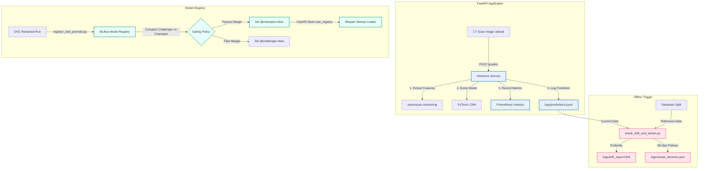

# PulmoScan AI: End-to-End MLOps Monitoring, Observability & Registry Deep-Dive

This reference document provides a comprehensive technical guide on the monitoring, observability, drift detection, model registry, and retraining gating systems implemented in **PulmoScan AI**. It includes direct references to the current codebase for end-to-end learning.

---

## 1. MLOps System Architecture & Philosophy

Production machine learning systems require active closed-loop feedback. Without observability and lifecycle automation, a deployed model operates blindly, suffering from silent failures due to **data drift**, **concept drift**, or **out-of-distribution (OOD) inputs**.

This system closes that loop through four integrated layers:



---

## 2. Live Observability & Prometheus Metrics

Exposing standard server-level metrics is insufficient for ML systems. The serving layer implements dual request-level and model-level instrumentation.

### 2.1 Standard API Instrumentation (`app/main.py`)
Using `prometheus-fastapi-instrumentator`, the FastAPI application automatically intercepts incoming requests. If the dependency is missing, the app mounts a fallback standard ASGI middleware.

*Code Reference: `app/main.py`*
```python
# Prometheus instrumentation fallback mechanism
try:
    from prometheus_fastapi_instrumentator import Instrumentator
    Instrumentator().instrument(app).expose(app)
except ImportError:
    from prometheus_client import make_asgi_app
    metrics_app = make_asgi_app()
    app.mount("/metrics", metrics_app)
```

### 2.2 Model-Level Prometheus Metrics (`app/core/metrics.py`)
Custom Prometheus indicators measure the live behavior of predictions and inputs, defined using `prometheus_client` Counters and Histograms.

*Code Reference: `app/core/metrics.py`*
*   **`PREDICTION_COUNT` (Counter):** Tracks total predictions made, labeled by `predicted_class`.
*   **`PREDICTION_CONFIDENCE` (Histogram):** Captures confidence distributions per class (`[0.0, ..., 1.0]`).
*   **`PREDICTION_ENTROPY` (Histogram):** Captures normalized entropy representing uncertainty.
*   **`IMAGE_BRIGHTNESS`, `IMAGE_CONTRAST`, `IMAGE_SHARPNESS` (Histograms):** Tracks image input feature distribution.

These metrics are observed in real-time during each prediction within `app/services/inference.py`.

---

## 3. Real-Time Feature Extraction & Prediction Logging

Tabular drift libraries (like Evidently) cannot operate on raw pixel values. Instead, during inference, the service extracts structural scalar image features and model prediction features, appending them to a persistent JSONL log.

### 3.1 Scalar Image Feature Extraction
Incoming PIL images are normalized and mapped to structural features:
*   **Mean Brightness** & **Contrast Standard Deviation**
*   **Laplacian Sharpness**: Measures edge energy. A sharp change indicates blurred uploads or major hardware modifications.

### 3.2 Live Logging Implementation (`app/services/inference.py`)
During each request, `predict()` calculates the inference output, updates Prometheus metrics, and appends a structured record to `logs/predictions.jsonl`.

*Code Reference: `app/services/inference.py`*
```python
# Calculates normalized entropy
entropy = normalized_entropy(probs.tolist())

# Record custom Prometheus metrics
PREDICTION_COUNT.labels(predicted_class=label).inc()
PREDICTION_CONFIDENCE.labels(predicted_class=label).observe(confidence)
IMAGE_SHARPNESS.observe(features.get("sharpness", 0.0))

# Append to prediction logs/predictions.jsonl
log_entry = {
    "timestamp": datetime.now(timezone.utc).isoformat(),
    "predicted_label": label,
    "confidence": round(confidence, 6),
    "entropy": round(entropy, 6),
    **features
}
with open(log_path, "a") as f:
    f.write(json.dumps(log_entry) + "\n")
```

---

## 4. Tabular Data Drift Detection with Evidently

Every model deployment has a reference baseline (the dataset it was trained on) and production data. Evidently evaluates drift by comparing their feature distributions.

### 4.1 Dynamic Reference Generation (`scripts/check_drift_and_retrain.py`)
To avoid managing separate training-feature files, the pipeline builds the reference baseline dynamically by sampling the raw `Data/train` directory and extracting features using the same model serving logic.

*Code Reference: `scripts/check_drift_and_retrain.py` -> `build_reference_dataset`*
```python
def build_reference_dataset(model_path, data_root, n_samples):
    # Takes random subset of training data, runs extract_image_features,
    # and processes predictions using the model checkpoint to compute baseline entropy.
    ...
```

### 4.2 Robust Evidently Drift Analysis (`pulmoscan/monitoring/drift.py`)
Evidently's public API changed substantially between the 0.4.x line and 0.6+. The module `pulmoscan/monitoring/drift.py` abstracts this behind `run_drift_report`, defensively falling back to the legacy API if the modern one fails.

*Code Reference: `pulmoscan/monitoring/drift.py` -> `run_drift_report`*
```python
try:
    summary, raw = _run_modern(ref, cur, html_path)
except (ImportError, Exception):
    summary, raw = _run_legacy(ref, cur, html_path)
```
This report checks both Numeric columns (Image features, confidence, entropy) and Categorical columns (Predictions) for distribution shifts.

---

## 5. MLOps Decision Gating

Decision-making rules isolate business logic from drift evaluation mechanisms.

### 5.1 Retraining Decision Gate (`scripts/check_drift_and_retrain.py`)
The script evaluates if retraining is required based on two factors evaluated in `pulmoscan/monitoring/decisions.py`:
1.  **Dataset Drift:** Evidently flags the dataset as drifted (e.g., > 50% columns drifted).
2.  **Confidence Collapse:** High percentage of out-of-distribution inputs (e.g., predictions with confidence < 70% crosses a 25% threshold).

If either condition triggers, the script writes a decision artifact (`logs/retrain_decision.json`) that can be picked up by a CI/CD pipeline to automate a DVC pipeline rerun.

### 5.2 Model Promotion Gate (`scripts/register_and_promote.py`)
Following retraining, a newly trained model (Challenger) must be evaluated against the incumbent model (Champion).

*Code Reference: `scripts/register_and_promote.py`*
```python
decision = should_promote(
    challenger=metric_val,       # Extracted from MLflow Challenger Run
    champion=champion_metric,    # Extracted from Champion Model Version Tags
    min_margin=args.min_margin,
)
```

---

## 6. MLflow Model Registry Promotion & Loading

Instead of manual file management, we use MLflow Model Registry's **aliases** to decouple code from specific model versions.

### 6.1 Promotion Alias Scheme (`pulmoscan/registry.py`)
The registry module manages MLflow Client interactions to set version aliases:
*   `champion`: The active production model.
*   `challenger`: The latest candidate model.
*   `challenger-backup`: The previous champion.

*Code Reference: `pulmoscan/registry.py` -> `register_version`*
Registers the version and natively attaches metrics as version tags (`metric.accuracy`) so promotion can compare performance without locating the underlying evaluation runs.

### 6.2 Dynamic Registry Loader (`app/main.py`)
The FastAPI lifespan startup manager natively resolves local SQLite artifact locations without a dedicated tracking server, minimizing network bottlenecks.

*Code Reference: `app/main.py` -> `lifespan`*
```python
if settings.use_registry:
    # Resolves the 'champion' alias dynamically
    mv = client.get_model_version_by_alias(settings.mlflow_model_name, "champion")
    
    # Safely handles mlflow.artifacts.download_artifacts and locates 'model.pt'
    download_path = mlflow.artifacts.download_artifacts(mv.source)
    # Finds model.pt inside the downloaded artifact directory hierarchy
    inference_service.load(model_file)
```
This local-first registry load pattern provides robust central version tracking while maintaining lightning-fast local deployment.

---

## 7. Operational Playbook & Verification

### 7.1 Simulated Production Traffic
To feed predictions and generate logs:
```bash
for i in {1..12}; do
  curl -s -X POST http://localhost:8000/api/v1/predict -F "file=@Data/test/normal/10.png"
done
```

### 7.2 Check Observability Metrics
Query the Prometheus endpoint to verify custom counters and image histograms:
```bash
curl -s http://localhost:8000/metrics | grep -E "(prediction|image_brightness|image_contrast|image_sharpness)"
```

### 7.3 Run Drift & Retraining Gating
Execute Evidently drift analysis and retraining evaluations over the logs:
```bash
PYTHONPATH=. python scripts/check_drift_and_retrain.py --min-samples 10
```

### 7.4 Promote and Deploy New Models
Promote a completed MLflow run to `@champion`:
```bash
PYTHONPATH=. python scripts/register_and_promote.py --run-id <mlflow_run_id> --min-margin 0.005
```
Start your server with MLflow registry loading enabled:
```bash
USE_REGISTRY=true uvicorn app.main:app --port 8000
```
