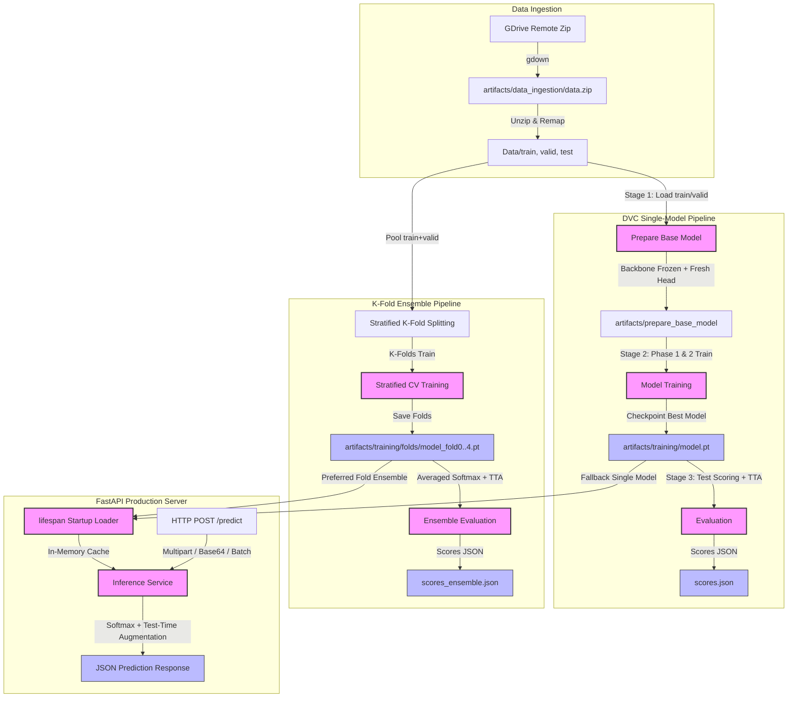

# PulmoScan AI: End-to-End Pipeline Architecture & Deep Dive

This document provides a highly detailed, comprehensive breakdown of the end-to-end machine learning pipeline for **PulmoScan AI**. It covers everything from dataset ingestion and transfer learning to stratified cross-validation, ensembling, API deployment, and MLflow observability.

---

## 1. High-Level Architecture Overview

PulmoScan AI is designed with a strict **train/serve parity** philosophy. Every hyperparameter, model structure, and preprocessing step is managed through a single source of truth, ensuring that model behavior in production matches training performance exactly.

The architecture comprises two primary workflows that output self-describing checkpoints loaded by the serving layer:



---

## 2. Core Preprocessing & Parity

To prevent train/serve drift (one of the most common failures in production ML), both the training pipeline and the serving API import architecture definitions and image transforms from a single module: `pulmoscan/models/cnn.py`.

### 2.1 Pretrained Normalization (ImageNet Statistics)
All supported backbones are initialized with ImageNet-pretrained weights and expect 3-channel (RGB) inputs normalized using per-channel means and standard deviations:
*   **Mean:** `[0.485, 0.456, 0.406]`
*   **Std:** `[0.229, 0.224, 0.225]`

### 2.2 Preprocessing Pipeline
*   **Training Augmentations:** Includes `RandomResizedCrop(224, scale=(0.8, 1.0))`, `RandomHorizontalFlip()`, `RandomRotation(15)`, and `ColorJitter(brightness=0.1, contrast=0.1)`.
*   **Deterministic Evaluation Transforms:** Used during validation, testing, and serving. It deterministic-resizes images using `InterpolationMode.BILINEAR` to the target image size (default `224x224`), converts to a tensor, and normalizes. No random augmentations leak into validation or serving.

---

## 3. Step-by-Step Training Stages (DVC DAG)

### Stage 01: Data Ingestion
*   **Component:** `pulmoscan.components.data_ingestion.DataIngestion`
*   **Pipeline Entry:** `pulmoscan.pipeline.stage_01_data_ingestion.DataIngestionTrainingPipeline`
*   **Workflow:**
    1.  Extracts the file ID from the configured Google Drive share URL in `config.yaml`.
    2.  Uses the `gdown` library to download the compressed ZIP archive into `artifacts/data_ingestion/data.zip`.
    3.  Extracts the ZIP archive to the project root directory.
    4.  **Dataset Canonicalization:** The source Chest-CT dataset contains directory names like `adenocarcinoma_left.lower.lobe_T2_N0_M0_Ib` in training/validation splits, but simple `adenocarcinoma` in test splits. `pulmoscan/utils/data.py` remaps every folder to a canonical class index based on the folder's prefix (splitting on the first `_`). This normalizes the folder labels to 4 canonical classes:
        *   `adenocarcinoma`
        *   `large.cell.carcinoma`
        *   `normal`
        *   `squamous.cell.carcinoma`

### Stage 02: Prepare Base Model
*   **Component:** `pulmoscan.components.prepare_base_model.PrepareBaseModel`
*   **Pipeline Entry:** `pulmoscan.pipeline.stage_02_prepare_base_model.PrepareBaseModelTrainingPipeline`
*   **Supported Backbones:** ResNet-50 (`resnet50`), ConvNeXt-Tiny (`convnext_tiny`), and EfficientNet-V2-S (`efficientnet_v2_s`).
*   **Workflow:**
    1.  Loads the pretrained network from PyTorch's model registry.
    2.  Freezes the backbone parameters by setting `requires_grad = False` on every parameter.
    3.  Replaces the classifier head (e.g. `fc` for ResNet or `classifier[2]/classifier[1]` for ConvNeXt/EfficientNet) with a new, randomly initialized `nn.Linear` layer targeting `NUM_CLASSES` (default `4`). The parameters of this new head keep `requires_grad = True`.
    4.  Saves the model as `artifacts/prepare_base_model/base_model_updated.pt`.

### Stage 03: Model Training
*   **Component:** `pulmoscan.components.model_trainer.Training`
*   **Pipeline Entry:** `pulmoscan.pipeline.stage_03_model_trainer.ModelTrainingPipeline`
*   **Two-Phase Transfer Learning Strategy:**
    *   **Phase 1: Classifier Head Tuning (Backbone Frozen):**
        *   Trains *only* the newly initialized linear classifier head for `EPOCHS` (default `15`) at a learning rate of `0.001`.
        *   Keeps the backbone frozen to establish a stable starting gradient for the classification task without damaging the pretrained feature extractor.
    *   **Phase 2: Full End-to-End Fine-Tuning (Whole Network Unfrozen):**
        *   Unfreezes all parameters (`requires_grad = True`) and trains for `FINE_TUNE_EPOCHS` (default `20`) at a very low learning rate (`FINE_TUNE_LR = 0.00005`).
        *   Enables the backbone to adapt slightly to the specific patterns of lung CT scans while avoiding catastrophic forgetting.
*   **Regularization & Training Stability Features:**
    *   **Label Smoothing (`LABEL_SMOOTHING = 0.1`):** Prevents the model from becoming overly confident, discouraging overfitting.
    *   **Inverse-Frequency Class Weighting (`USE_CLASS_WEIGHTS = true`):** Computes weights inversely proportional to class frequencies to handle imbalances in the training split.
    *   **Cosine Annealing Scheduler:** Uses `CosineAnnealingLR` to smoothly decay learning rates towards zero at the end of each phase.
    *   **Early Stopping:** Evaluates model validation accuracy per epoch. If validation accuracy fails to improve within `EARLY_STOPPING_PATIENCE` epochs, the active phase terminates early.
    *   **Self-Describing Checkpoints:** Checks validation accuracy after each epoch. On improvement, saves a dictionary containing:
        *   `state_dict`: Model weights.
        *   `backbone`: Name of the architecture backbone.
        *   `num_classes`: Number of classes.
        *   `class_names`: List of canonical target labels in order.
        *   `image_size`: Resolution required by the model.
        This design guarantees that the checkpoint is entirely self-sufficient—the serving layer needs nothing else to load and run it.

### Stage 04: Single-Model Evaluation
*   **Component:** `pulmoscan.components.evaluation.Evaluation`
*   **Pipeline Entry:** `pulmoscan.pipeline.stage_04_evaluation.EvaluationPipeline`
*   **Workflow:**
    1.  Loads the trained model checkpoint onto the selected hardware device (CUDA, MPS, or CPU) and places it in `eval` mode.
    2.  Reads the held-out `Data/test` split (never seen during training or validation).
    3.  **Test-Time Augmentation (TTA):** For each test image, passes both the original image and its horizontal flip through the model, averaging the resulting softmax probabilities. TTA provides a robust, zero-leakage accuracy gain (~0.5%-1.0%) for free.
    4.  Computes test metrics using scikit-learn:
        *   Cross-entropy loss
        *   Macro-averaged Precision
        *   Macro-averaged Recall
        *   Macro-averaged F1 Score
        *   Overall Accuracy
    5.  Saves metrics into `scores.json` and logs parameters and metrics to MLflow.

---

## 4. Advanced: Stratified K-Fold & Ensembling

For maximum generalization stability on small or imbalanced datasets, PulmoScan AI supports an advanced k-fold ensembling workflow.

```
                          ┌───────────────────────────┐
                          │   Pooled Train + Valid    │
                          └─────────────┬─────────────┘
                                        │
             ┌──────────────────────────┼──────────────────────────┐
             ▼                          ▼                          ▼
      ┌─────────────┐            ┌─────────────┐            ┌─────────────┐
      │   Fold 1    │            │   Fold 2    │            │   Fold 5    │
      │  Train/Val  │            │  Train/Val  │            │  Train/Val  │
      └──────┬──────┘            └──────┬──────┘            └──────┬──────┘
             │                          │                          │
             ▼                          ▼                          ▼
      ┌─────────────┐            ┌─────────────┐            ┌─────────────┐
      │ model_fold0 │            │ model_fold1 │            │ model_fold4 │
      └──────┬──────┘            └──────┬──────┘            └──────┬──────┘
             │                          │                          │
             └──────────────────────────┼──────────────────────────┘
                                        │
                                        ▼
                          ┌───────────────────────────┐
                          │     Ensemble Predictor    │
                          │ (Softmax Average + TTA)   │
                          └───────────────────────────┘
```

### 4.1 K-Fold Cross-Validation (`scripts/train_kfold.py`)
Instead of training on a single static split, the cross-validation script pools the `Data/train` and `Data/valid` splits into one dataset containing both paths. The `Data/test` split remains strictly isolated.
1.  Initiates `StratifiedKFold` from scikit-learn with `k` folds (default `5`), maintaining identical class distributions across all folds.
2.  Iteratively trains `k` independent models. For each fold, a model is initialized from the base weights (`base_model_updated.pt`), trained on the `k-1` training folds, validated on the held-out fold, and checkpointed when validation accuracy improves.
3.  Saves checkpoints as `model_fold0.pt` through `model_fold4.pt` in `artifacts/training/folds/`.
4.  Logs fold-specific metrics as nested runs under a single parent run in MLflow, calculating an unbiased cross-validation mean accuracy.

### 4.2 Ensemble Evaluation (`scripts/eval_ensemble.py`)
1.  Loads all fold checkpoints from `artifacts/training/folds/`.
2.  During evaluation, passes each test image through *every* fold model, computing softmax probabilities.
3.  Averages the probabilities across all `k` models. If TTA is enabled, it also averages across the horizontal flips for a total of `2 * k` forward passes per prediction.
4.  Calculates macro metrics and saves them to `scores_ensemble.json`. This workflow consistently achieves the project's highest accuracy (approx. **92.1%**).

---

## 5. FastAPI Serving Layer

The production serving layer (`app/main.py`) is designed for fast, asynchronous, and reliable inference.

### 5.1 Lifespan Startup Logic
The application startup lifespan context manager manages memory-cached model loading:
1.  Checks if the ensemble directory (`artifacts/training/folds` or environment override) contains two or more fold checkpoints.
2.  If present, loads them as an ensemble.
3.  If no ensemble is found, it attempts to load the single checkpoint at `MODEL_PATH` (`artifacts/training/model.pt`).
4.  If neither is found, the API boots in a degraded status (health checks return warnings, and prediction requests return `503 Service Unavailable`), preventing hard crashes.

### 5.2 Inference Workflow
*   **Request Inputs:** Supports single file uploads (multipart form-data), batch uploads (up to 32 files), and base64 JSON payloads (useful for cloud functions or serverless environments).
*   **Transforms Consistency:** Reuses `get_eval_transforms` to guarantee that images are resized and normalized identically to training.
*   **Softmax Averaging & TTA:** When the ensemble is loaded, the service extracts outputs from each model, averages the softmax distributions, applies TTA if enabled, and outputs the resulting confidence scores and inference times in milliseconds.

---

## 6. MLflow Observability Integration

PulmoScan AI has full MLflow integration to track training runs, parameters, metrics, and models.

*   **Tracking URI:** Defaults to a local SQLite database (`sqlite:///mlflow.db`) to enable run comparisons, trace metrics, and avoid file-store deprecation issues.
*   **Run Organization:**
    *   **Single-Model Runs:** Created under `single-train` and `single-eval` runs, logging parameters (backbone, LR, decay, smoothing, epochs) and per-epoch training and validation loss/accuracy.
    *   **K-Fold Runs:** Uses a parent-child structure. The parent run `kfold-train` logs overall configuration and hyperparameter variables, while each fold trains in a nested child run (`fold-0`, `fold-1`, etc.).
*   **Artifact Logging:** At the end of a successful run, the final serialized self-describing model checkpoint is uploaded directly to MLflow's artifact store.

---

## 7. Data Version Control (DVC) Pipeline

The entire workflow is formalized into a Directed Acyclic Graph (DAG) in `dvc.yaml` for reproducible execution.

```yaml
stages:
  data_ingestion:
    cmd: python -m pulmoscan.pipeline.stage_01_data_ingestion
    deps:
      - pulmoscan/pipeline/stage_01_data_ingestion.py
      - pulmoscan/components/data_ingestion.py
      - config/config.yaml
    outs:
      - Data

  prepare_base_model:
    cmd: python -m pulmoscan.pipeline.stage_02_prepare_base_model
    deps:
      - pulmoscan/pipeline/stage_02_prepare_base_model.py
      - pulmoscan/components/prepare_base_model.py
      - pulmoscan/models/cnn.py
      - config/config.yaml
    params:
      - BACKBONE
      - PRETRAINED
      - FREEZE_BACKBONE
      - NUM_CLASSES
      - IMAGE_SIZE
    outs:
      - artifacts/prepare_base_model

  training:
    cmd: python -m pulmoscan.pipeline.stage_03_model_trainer
    deps:
      - pulmoscan/pipeline/stage_03_model_trainer.py
      - pulmoscan/components/model_trainer.py
      - pulmoscan/models/cnn.py
      - pulmoscan/utils/data.py
      - config/config.yaml
      - Data/train
      - Data/valid
      - artifacts/prepare_base_model
    params:
      - BACKBONE
      - NUM_CLASSES
      - IMAGE_SIZE
      - EPOCHS
      - BATCH_SIZE
      ...
    outs:
      - artifacts/training/model.pt
      - artifacts/training/class_names.json

  evaluation:
    cmd: python -m pulmoscan.pipeline.stage_04_evaluation
    deps:
      - pulmoscan/pipeline/stage_04_evaluation.py
      - pulmoscan/components/evaluation.py
      - pulmoscan/models/cnn.py
      - pulmoscan/utils/data.py
      - config/config.yaml
      - Data/test
      - artifacts/training/model.pt
    params:
      - IMAGE_SIZE
      - BATCH_SIZE
      - USE_TTA
    metrics:
      - scores.json:
          cache: false
```

*   **Caching & Dependency Checking:** By running `dvc repro`, DVC computes MD5 content hashes of all declared dependencies (`deps`). If a file or configuration remains unchanged, DVC skips that stage entirely, retrieving the output from its local cache.
*   **Collaboration & Remote Storage:** Heavy assets (dataset folders and `.pt` model files) are ignored by git to keep the repository small and lightweight. Instead, content hashes are tracked in `dvc.lock`. Running `dvc pull` retrieves the actual files from the designated Google Drive remote store.
