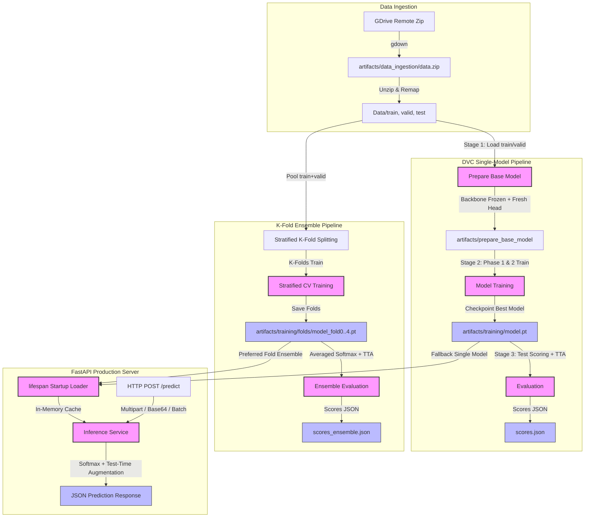

# PulmoScan AI: End-to-End Pipeline Architecture & Deep Dive

This document provides a highly detailed, comprehensive breakdown of the end-to-end machine learning pipeline for **PulmoScan AI**. It covers everything from dataset ingestion and transfer learning to stratified cross-validation, ensembling, API deployment, and MLflow observability, directly referencing the project's codebase.

---

## 1. High-Level Architecture Overview

PulmoScan AI is designed with a strict **train/serve parity** philosophy. Every hyperparameter, model structure, and preprocessing step is managed through a single source of truth, ensuring that model behavior in production matches training performance exactly.

The architecture comprises two primary workflows that output self-describing checkpoints loaded by the serving layer:



---

## 2. Core Preprocessing & Parity (`pulmoscan/models/cnn.py`)

To prevent train/serve drift (one of the most common failures in production ML), both the training pipeline and the serving API import architecture definitions and image transforms from a single module: `pulmoscan/models/cnn.py`.

### 2.1 Pretrained Normalization (ImageNet Statistics)
All supported backbones are initialized with ImageNet-pretrained weights and expect 3-channel (RGB) inputs normalized using standard ImageNet per-channel means and standard deviations.

### 2.2 Deterministic Evaluation Transforms
During validation, testing, and *live serving*, the identical pipeline is applied using `get_eval_transforms()` to guarantee no random augmentations leak into validation or serving.

*Code Reference: `pulmoscan/models/cnn.py`*
```python
def get_eval_transforms(image_size: int = 224) -> transforms.Compose:
    return transforms.Compose([
        transforms.Resize((image_size, image_size), interpolation=InterpolationMode.BILINEAR),
        transforms.ToTensor(),
        transforms.Normalize(mean=[0.485, 0.456, 0.406], std=[0.229, 0.224, 0.225]),
    ])
```

---

## 3. Step-by-Step Training Stages (DVC DAG)

### Stage 01: Data Ingestion (`pulmoscan.components.data_ingestion`)
*   **Workflow:**
    1.  Uses the `gdown` library to download the compressed ZIP archive from Google Drive.
    2.  Extracts the archive to `Data/`.
    3.  **Dataset Canonicalization:** The source dataset is remapped using string mapping to normalized target labels (`adenocarcinoma`, `normal`, etc.) via logic in `pulmoscan.utils.data`.

### Stage 02: Prepare Base Model (`pulmoscan.components.prepare_base_model`)
*   **Supported Backbones:** ResNet-50, ConvNeXt-Tiny, and EfficientNet-V2-S.
*   **Workflow:**
    1.  Loads the pretrained network.
    2.  Freezes the backbone parameters by setting `requires_grad = False` on every parameter.
    3.  Replaces the classifier head with a new, randomly initialized `nn.Linear` layer targeting `NUM_CLASSES`. The parameters of this new head keep `requires_grad = True`.

### Stage 03: Model Training (`pulmoscan.components.model_trainer`)
*   **Two-Phase Transfer Learning Strategy:**
    *   **Phase 1 (Backbone Frozen):** Trains *only* the newly initialized linear classifier head to establish a stable starting gradient.
    *   **Phase 2 (End-to-End Fine-Tuning):** Unfreezes all parameters and trains at a very low learning rate to adapt slightly to CT scan patterns while avoiding catastrophic forgetting.
*   **Self-Describing Checkpoints:**
    To ensure the serving layer doesn't need separate configuration files to load the model correctly, the trainer serializes complete metadata into the `.pt` file.
    *Code Reference: `pulmoscan/components/model_trainer.py`*
    ```python
    checkpoint = {
        "state_dict": self.model.state_dict(),
        "backbone": self.config.params_backbone,
        "num_classes": self.config.params_num_classes,
        "class_names": class_names,
        "image_size": self.config.params_image_size,
    }
    torch.save(checkpoint, self.config.trained_model_path)
    ```

### Stage 04: Single-Model Evaluation (`pulmoscan.components.evaluation`)
*   Loads the trained checkpoint and applies **Test-Time Augmentation (TTA)** (averaging softmax scores of original and horizontally flipped images) for robust, zero-leakage accuracy gains.
*   Computes metrics and logs them to MLflow.

---

## 4. Advanced: Stratified K-Fold & Ensembling

For maximum generalization stability on small datasets, PulmoScan AI supports an advanced k-fold ensembling workflow (`scripts/train_kfold.py`).

### 4.1 Stratified Split Implementation (`pulmoscan/utils/data.py`)
Instead of a single fixed validation set, the dataset builder uses Scikit-Learn's `StratifiedKFold` to yield cross-validation indices that maintain class distribution proportions exactly.

*Code Reference: `pulmoscan/utils/data.py`*
```python
skf = StratifiedKFold(n_splits=k_folds, shuffle=True, random_state=seed)
for train_idx, val_idx in skf.split(np.zeros(len(dataset)), labels):
    # Generates precise fold splits
```

### 4.2 Ensemble Inference Aggregation (`app/services/inference.py`)
When multiple models (folds) are loaded, the inference service forwards the tensor through all models and averages their confidence.

*Code Reference: `app/services/inference.py`*
```python
for model in self._models:
    p = F.softmax(model(tensor), dim=1)
    if self.use_tta:
        flipped = F.softmax(model(torch.flip(tensor, dims=[3])), dim=1)
        p = (p + flipped) / 2
    probs = p if probs is None else probs + p
probs = (probs / len(self._models))[0].cpu()
```

---

## 5. FastAPI Serving Layer (`app/main.py`)

The production serving layer (`app/main.py`) is designed for fast, asynchronous, and reliable inference.

### 5.1 Lifespan Startup Logic
If MLflow registry loading (`USE_REGISTRY`) is turned off or fails, the application startup lifecycle gracefully falls back to local file checks.

*Code Reference: `app/main.py`*
```python
fold_paths = sorted(glob.glob(os.path.join(settings.ensemble_dir, "model_fold*.pt")))
if len(fold_paths) >= 2:
    inference_service.load_ensemble(fold_paths)
elif os.path.exists(settings.model_path):
    inference_service.load(settings.model_path)
else:
    logger.warning("No model found. API runs in degraded mode.")
```
If no models are found, the service enters degraded status rather than a crashloop, returning HTTP `503` for predictions while keeping health-checks active.

---

## 6. Data Version Control (DVC) Pipeline

The entire workflow is formalized into a Directed Acyclic Graph (DAG) in `dvc.yaml` for reproducible execution.

```yaml
stages:
  data_ingestion:
    cmd: python -m pulmoscan.pipeline.stage_01_data_ingestion
    deps:
      - pulmoscan/pipeline/stage_01_data_ingestion.py
      - config/config.yaml
    outs:
      - Data

  training:
    cmd: python -m pulmoscan.pipeline.stage_03_model_trainer
    deps:
      - pulmoscan/pipeline/stage_03_model_trainer.py
      - Data/train
      - Data/valid
      - artifacts/prepare_base_model
    outs:
      - artifacts/training/model.pt
```

*   **Caching & Dependency Checking:** By running `dvc repro`, DVC computes MD5 content hashes of all declared dependencies (`deps`). If a file or configuration remains unchanged, DVC skips that stage entirely, retrieving the output from its local cache.
*   **Remote Storage Integration:** Code remains lightweight via `git`, while heavy binary files (like weights and CT images) are managed by `dvc pull` via a remote storage bucket, secured by lockfiles.
