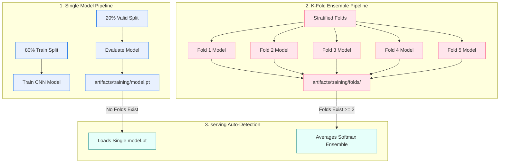

# 🔀 PulmoScan AI: Single to K-Fold Ensemble Transition Playbook

This playbook is a custom developer guide to walk you through letting your **currently running Single Model training** finish, comparing its performance, resetting the workspace, running a **5-Fold Ensemble training**, and deploying the ensemble.

---

## 🗺️ Single vs. K-Fold Architecture comparison



---

## 🚀 Step-by-Step Transition Playbook

### Step 1: Let the Single Model Training Finish
Since your single model training is already running, wait for it to complete. Once finished, verify the generated files:

*   **Model Checkpoint**: [artifacts/training/model.pt](file:///Users/nafiz/Development/pulmoscan-ai/artifacts/training/model.pt)
*   **Evaluation Scorecard**: Open [scores.json](file:///Users/nafiz/Development/pulmoscan-ai/scores.json) to see your test accuracy.
*   **MLflow Record**: Open [http://localhost:5050](http://localhost:5050). You will see a completed run named `single-train` logging parameters and metrics.

---

### Step 2: Stop serving & Prepare for K-Fold
Before starting K-Fold, bring down the serving container to free up memory (training uses GPU/CPU intensely):

```bash
make down
```

---

### Step 3: Trigger the 5-Fold Training Pipeline
You can run your 5-Fold cross-validation directly using the Python CLI or through DVC. 

Run this command in your terminal:
```bash
# PYTHONPATH=. python scripts/train_kfold.py --k <number_of_folds>
PYTHONPATH=. python scripts/train_kfold.py --k 5
```
*(Or run `dvc repro train_kfold`)*

#### What happens under the hood during K-Fold?
1. **Stratified Splitting**: The data pool is divided into 5 equal, balanced chunks (folds).
2. **Iterative training**: The script trains 5 models in sequence. For fold 1, it trains on folds 2–5 and validates on fold 1. For fold 2, it trains on 1, 3–5 and validates on fold 2, etc.
3. **Weight Storage**: Fold weights are cleanly written to the directory:
   [artifacts/training/folds/](file:///Users/nafiz/Development/pulmoscan-ai/artifacts/training/folds/) (as `model_fold0.pt` ... `model_fold4.pt`).
4. **MLflow Nested Tracking**: Logs 1 parent run named `kfold-train` with 5 child runs (one for each fold) containing learning curves (`fold0/head/train_loss`, `fold0/finetune/val_acc`, etc.).

---

### Step 4: Boot API serving (Auto-Detects Folds)
Build and run the FastAPI serving container:
```bash
make build
make up
```

#### 🔍 How to verify it is running the K-Fold Ensemble?
Because your K-Fold outputs are stored in `artifacts/training/folds/`, the API lifespan startup manager automatically detects them and boots in **Ensemble Mode** rather than single-model mode.

Check your container startup logs:
```bash
make logs
```
Look for this line in the startup messages:
`Ensemble loaded: 5 models, backbone=convnext_tiny, classes=['adenocarcinoma', ...]`

---

### Step 5: Simulate Traffic & Validate Drift
Verify the ensembled predictions and check for drift across the multi-model feature space:

```bash
# 1. Send simulated chest CT scans
for i in {1..12}; do
  curl -s -X POST http://localhost:8000/api/v1/predict -F "file=@Data/test/normal/10.png"
done

# 2. Check for drift (compares baseline against serving logs)
PYTHONPATH=. python scripts/check_drift_and_retrain.py --min-samples 10
```
*The drift report at `logs/drift_report.html` will now check for feature shifts across predictions generated by the ensemble!*

---

### 💡 Pro-Tip: Switching back to Single Model serving
If you ever want to serve the Single Model again instead of the K-Fold Ensemble, **you don't need to rebuild or edit code**:
1. Temporarily move or rename the folds directory:
   ```bash
   mv artifacts/training/folds artifacts/training/folds_backup
   ```
2. Restart the API:
   ```bash
   make restart
   ```
   *Since the `folds/` directory is no longer present, the API will instantly fall back to loading the single model at `artifacts/training/model.pt`!*
